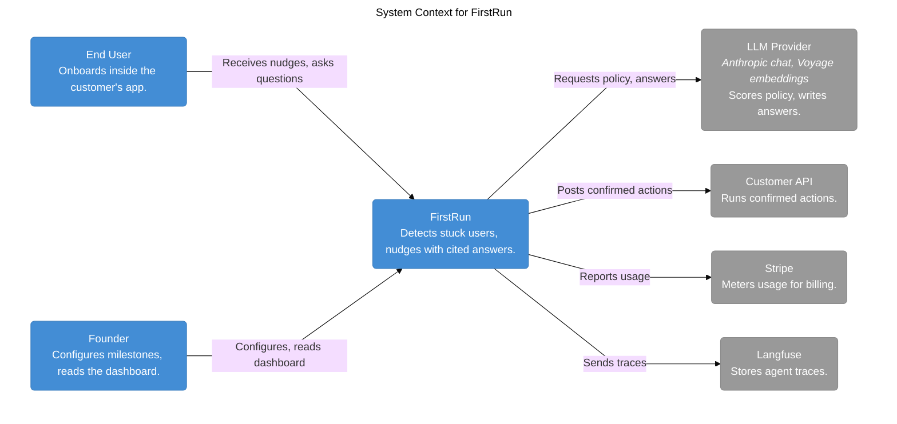
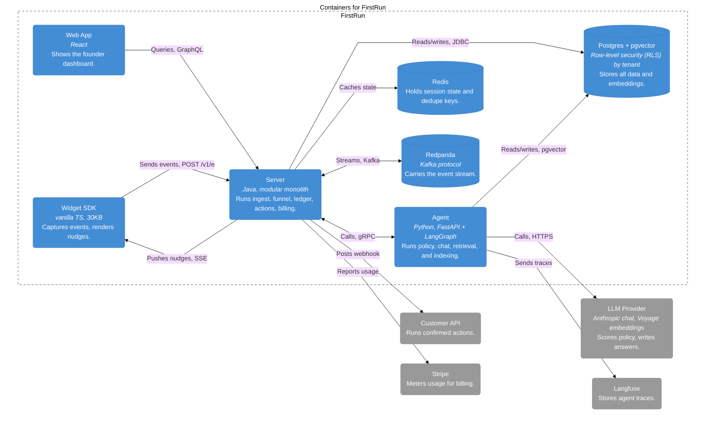
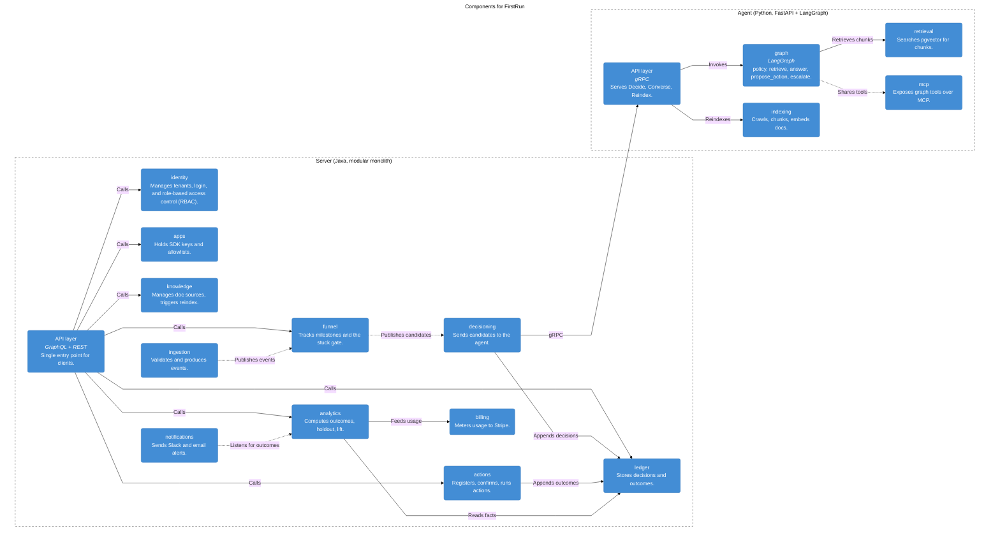
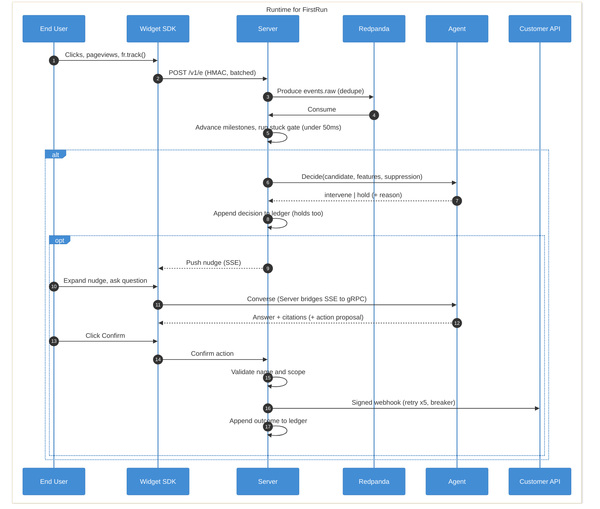
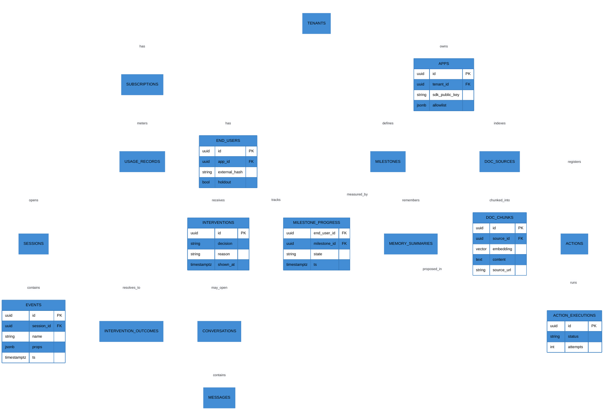
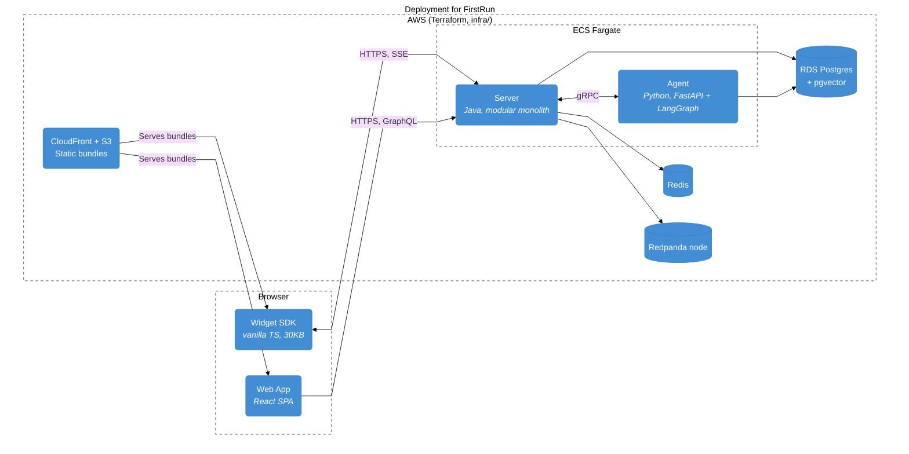

# FirstRun Architecture

Date: 2026-07-01

FirstRun reads the event stream from a customer's product, finds users stalled in
onboarding, and answers them with nudges and chat grounded in the product's own
docs, running a setup action only after the user confirms. A Java modular monolith
(`server/`) owns the product logic, and a single Python service (`agent/`) owns the
model loop. A vanilla TypeScript widget embeds in the customer's app, and Redpanda
carries the event stream. Every structural choice traces to a decision in
`docs/adr/`, so read those before changing one.

## System Context

Two kinds of people use FirstRun. End users only ever see it as the widget embedded
in the product and never hold an account with us, while founders sign in to the
dashboard to define milestones and read activation lift. The other four systems are
dependencies the platform calls out to for model inference, action webhooks,
billing, and tracing.

## Containers

The split between the server and the agent follows runtime forces, not architectural
layers. The server is a single deployable that owns every piece of stateful product
logic, and the agent is separate only because its model work needs Python (ADR-001).
Each boundary then uses the cheapest protocol that fits its load (ADR-003):

- REST carries high-volume ingest and outbound webhooks.
- GraphQL serves the dashboard's nested reads.
- gRPC connects the server and agent over a typed, streaming channel.

## Components

Inside the server, modules see each other only through published interfaces or
domain events, and ArchUnit with `ApplicationModules.verify()` enforces that in
continuous integration, where a broken boundary is a design defect. Three
constraints carry the most weight:

- The `ledger` is append-only, so no repository method may update or delete its
  rows.
- Only `analytics` and the API layer may import `billing`.
- `ingestion` stays allocation-light and never touches GraphQL types.

The Agent group is the other deployable, where the policy node uses a small model
and the answer node the stronger one, both at the external provider and swappable by
configuration. Because the agent holds the only provider access point, it also owns
the document index. On `Reindex` it crawls, chunks, and embeds a customer's docs
into pgvector, and retrieval reads them back at answer time. It parses every output
into a Pydantic model before returning it, so a malformed response or a provider
outage becomes a hold, and the product degrades to silence rather than a wrong
answer.

## Runtime

A deterministic gate, not the model, decides which events are worth a policy call,
so cost stays tied to stuck users instead of raw traffic (ADR-005). Every candidate
that clears the gate produces exactly one ledgered decision, intervene or hold, and
no webhook fires until the user clicks Confirm. Four budgets bound the path, and the
README publishes them while `make load` and the eval harness check them:

- The ingest gateway responds within 250ms at p99.
- The stuck gate runs under 50ms, in-stream.
- A policy decision returns within 2s at p95.
- The first chat token arrives within 1.5s at p95.

## Event Stream

The loop is asynchronous underneath, and each topic feeds its own consumer group
with its own dead-letter queue:

| Topic | Producer | Consumers (groups) | Key |
|---|---|---|---|
| `events.raw` | ingestion | stream-processor, archival, eval-capture | `hash(tenant_id, end_user_id)`, for per-user ordering |
| `events.enriched` | stream processor | analytics | adds session and milestone context |
| `intervention.candidates` | stuck gate | decisioning | only gated events, so model calls stay rare (ADR-005) |
| `intervention.outcomes` | server | analytics, billing-metering | engaged, dismissed, ignored, or attributed |
| `*.dlq` | each consumer | replay tooling | one per consumer |

Because delivery is at-least-once, every handler is idempotent and dedupes on the
event's unique ID by holding a Redis key for 24 hours. Replay tooling reprocesses
any dead-letter queue after a fix, and the eval harness replays `events.raw`
through its own group.

## Data Model

The whole schema lives in one Postgres instance, embeddings included, to avoid a
second datastore (ADR-004). A few conventions hold throughout:

- Keys are UUIDv7 (RFC 9562), and timestamps are UTC `timestamptz`.
- The `events` table is partitioned by day.
- Every tenant-scoped table carries a row-level security (RLS) policy,
  `USING (tenant_id = current_setting('app.tenant_id')::uuid)`.
- The `end_users.holdout` flag is a deterministic 10% hash bucket, set once at
  first sight and never changed (ADR-009).

## Deployment

The same code runs in two places:

- Locally, a single `docker compose up` brings up Postgres with pgvector, Redis,
  Redpanda, Langfuse, and the server, agent, web, and Tasklet.
- In production, ECS Fargate runs the server and agent beside RDS Postgres,
  Redis, and a single Redpanda node, while CloudFront and S3 serve the widget
  and dashboard bundles. `infra/` Terraform defines it all, and GitHub Actions
  deploys from main.

A request keeps one trace from the widget through to the agent over W3C Trace
Context in Kafka headers, and Prometheus and Grafana run in both environments.
Two guards keep the single-node footprint safe:

- The gateway sheds traffic per tenant with a Redis token bucket before anything
  reaches Kafka, so one noisy tenant cannot starve the rest.
- On shutdown, the services drain their Kafka consumers and in-flight server-sent
  event streams within the 30-second ECS stop grace period.
